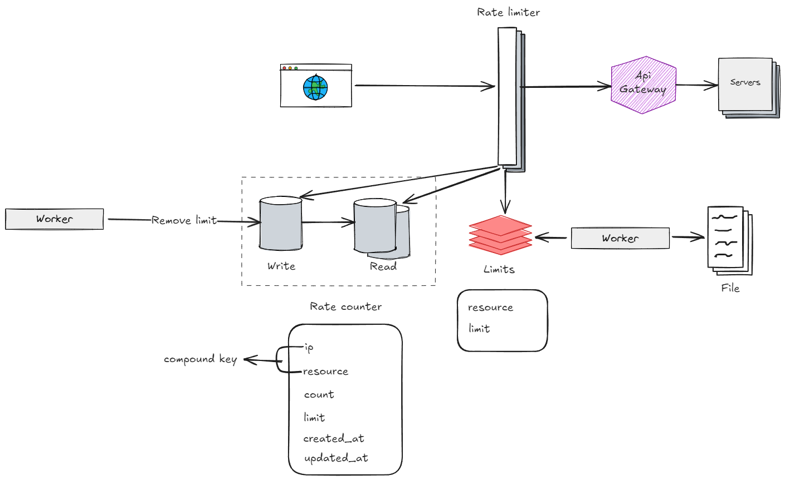

# Rate Limiter
## Context
A rate limiter is a component that limits the number of user's requests allowed over a period of time.
The advantages of this service is to prevent resource starvation in case of a DoS (Denial of Service) attack, 
reducing costs by limiting the number of calls to a thirty-party api and prevent servers overload.
## Requirements
### Functional
- [X] Accurately limit excessive requests
- [ ] Distributed rate limiting
- [X] Error handling
### Non-functional
- [X] Low latency. Should not slow down HTTP response time
- [X] Use as little memory as possible
- [ ] High fault tolerance
### High-level Design
